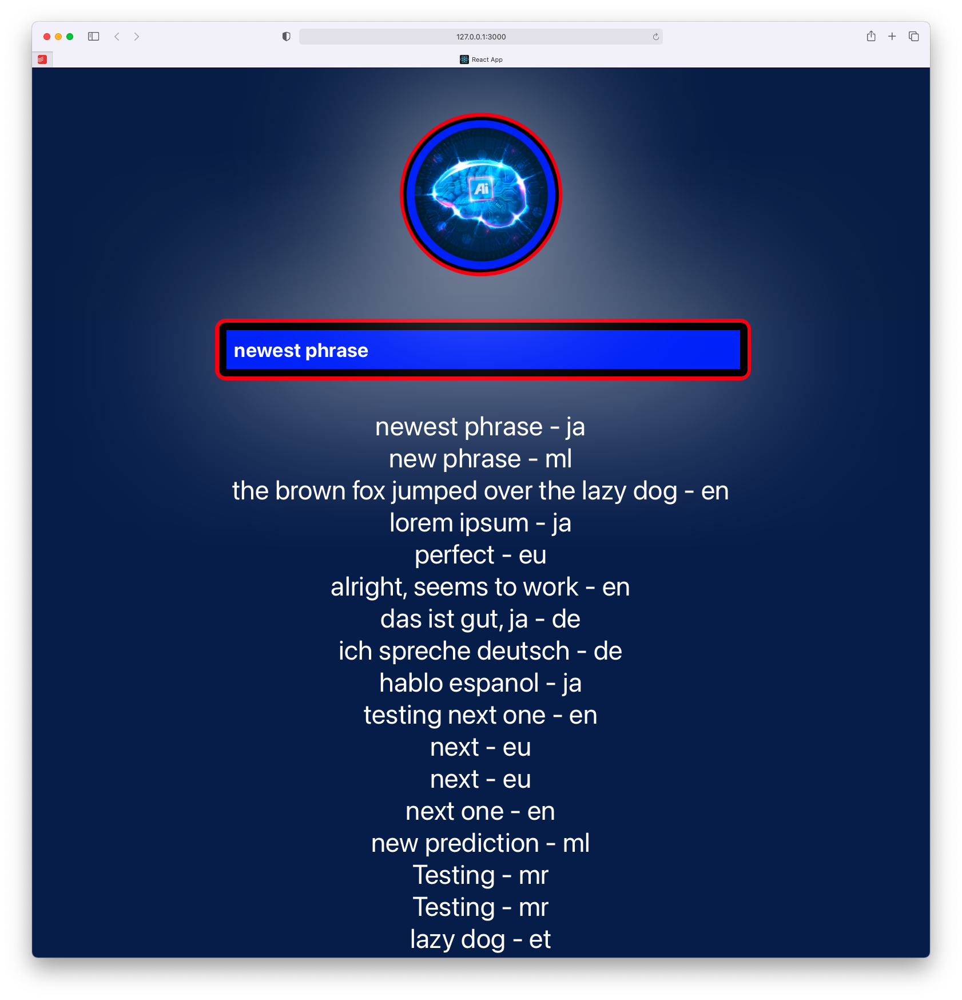

# billenium-keras-dashboard-react

This project was bootstrapped with [Create React App](https://github.com/facebook/create-react-app).

## Preview

## Available Scripts

In the project directory, you can run:

### `npm start`
### `npm test`
### `npm run build`
### `npm run eject`

**Note: this is a one-way operation. Once you `eject`, you can’t go back!**
